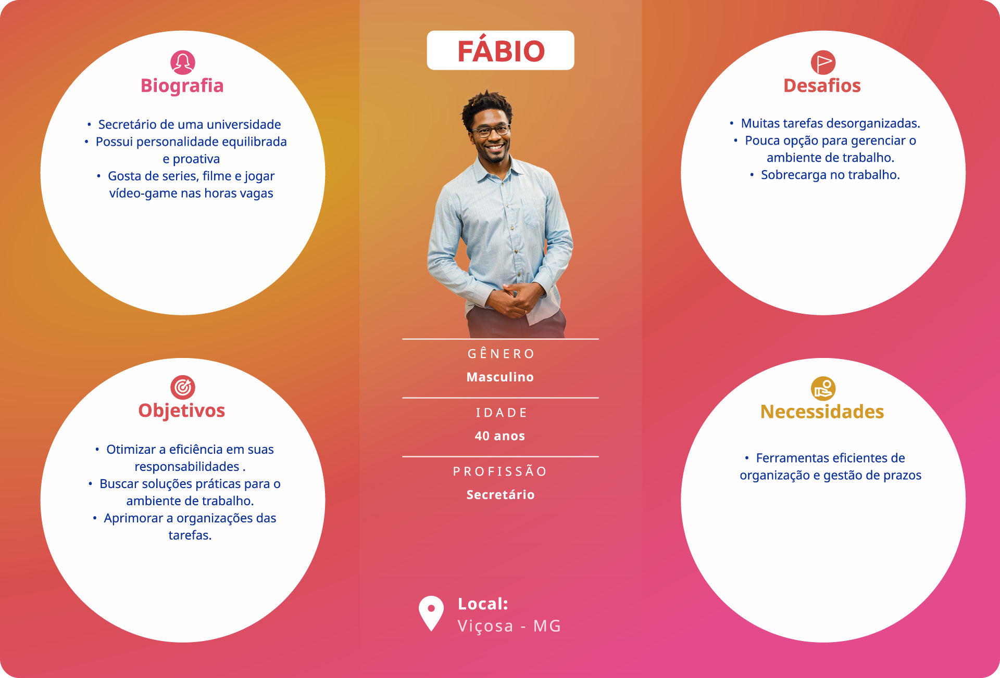

# Estudo de caso de Design de Interação e desenvolvimento de interface - Projeto NUPEX
# WHAT (O que)
## Introdução
Este estudo de caso destaca a introdução de um sistema de automatização dos trabalhos de secretaria no Núcleo de Pesquisa e Extensão (NUPEX) da Univiçosa, concentrando-se na aplicação dos princípios de Design de Interação. Diante da crescente necessidade de otimizar as operações administrativas, o objetivo é ir além da simples automatização, priorizando a criação de uma experiência de usuário que simplifique as tarefas diárias e promova uma interação mais eficiente.
Exploraremos como a implementação desses conceitos de design não apenas visa eliminar obstáculos burocráticos, mas também busca estabelecer uma interface intuitiva e acessível. Este estudo prático examinará como o Design de Interação pode redefinir a relação entre os colaboradores do NUPEX e o sistema, contribuindo para uma gestão mais fluida e transparente das informações.
## Contexto
A secretaria da Univiçosa tem a função de gerenciar os projetos dos pesquisadores, registrando se os projetos de pesquisa foram aceitos pelo comitê ou se necessitam de alguma alteração, além de acompanhar as datas de entrega. Atualmente, os funcionários dessa secretaria realizam esse trabalho de forma manual, utilizando cadernos e planilhas no Excel, o que consome muito tempo que poderia ser empregado em outras atividades.
Existem meios de facilitar esse trabalho por meio de sistemas de software, permitindo uma redução significativa no tempo gasto.
# WHEN (Quando)
* Início do Projeto:  25/09/2023
* Término do Projeto: 15/11/2023

**Fases do projeto:**
1. Pequisa e descoberta:
2. Design e iteração
3. Testes e validação
   
# WHO (Quem)
As pessoas envolvidas nesse projeto foram:

**Equipe de Design e Desenvolvimento:**
  * Fabricio Henrique de Freitas Albuquerque
  * Gabriella Moreira Ribeiro
  * João Victor Veríssimo
  * Relbert Alecxsander Ribas
  * Yuri Moreira Silva

**Clientes e Stakeholders:**
  * NUPEX - Núcleo de Ensino, Pesquisa e Extensão
  * Flávia Valente - Coordenadora SIMPAC

**Coordenadora**
  * Cristiane Aparecida Lana
# WHERE (Onde)
Instituição de ensino Univiçosa localizada na cidade Viçosa no estado Minas Gerais

# WHY (Por que)

Quem utilizará o sistema?
Pode ser utilizado para a maioria das secretarias em várias áreas que realizam trabalhos manuais semelhantes, permitindo o controle de projetos de diversas áreas. 
Quais seriam os problemas?
* Preenchimento incorreto de dados nas planilhas do Excel.
---
# Storytelling
"Num belo dia, enquanto folheava suas anotações em papel, Paula percebeu que havia uma pilha considerável de pesquisadores atrasados para notificar. A tarefa parecia avassaladora, e ela sentiu um peso sobre seus ombros. Perdida em meio a uma miríade de papéis e prazos, Paula começou a se preocupar com a enormidade da situação.

Foi então que, enquanto esfregava as têmporas para aliviar a dor de cabeça que começava a surgir, Paula teve um devaneio. Um raio de luz iluminou sua mente cansada, e ela imaginou um sistema mágico que pudesse fazer todo esse trabalho árduo por ela. Esse sistema seria capaz de notificar automaticamente os pesquisadores atrasados, poupando-lhe um tempo valioso.

Conforme o dia avançava, a fantasia de Paula se intensificava. Ela visualizou um assistente virtual encantado que, com um toque mágico, enviava mensagens de notificação aos pesquisadores, alertando-os gentilmente sobre os prazos iminentes. Cada notificação era acompanhada por um sopro de motivação, incentivando os pesquisadores a entregarem suas obras-primas acadêmicas no tempo certo.

Foi nesse instante que Paula teve a ideia de contatar a equipe TechCode,especializada em soluções inovadoras de tecnologia. Empolgada com a possibilidade de transformar sua visão fantástica em realidade, Paula pegou o telefone e marcou uma reunião com a equipe TechCode.

A equipe, composta por especialistas em Design de Interação, UI e UX, recebeu entusiasticamente o desafio apresentado por Paula. Juntos, começaram a desenvolver um sistema personalizado que atendesse às necessidades específicas da secretária. O design encantado e a funcionalidade intuitiva eram prioridades, garantindo que a magia tecnológica se alinhasse perfeitamente à realidade acadêmica de Paula. No dia do lançamento, Paula sentiu a magia tomando conta do escritório. O assistente virtual começou a notificar os pesquisadores automaticamente, guiando-os com gentileza e motivação. O design encantado tornava cada interação uma experiência agradável, e os pesquisadores respondiam com entusiasmo, entregando suas obras no prazo.

O projeto da TECHCODE começou a se moldar em resposta direta aos desafios específicos enfrentados por Paula. A equipe concentrou seus esforços em criar um sistema que automatizasse as notificações, economizando um tempo valioso para Paula se concentrar em tarefas mais estratégicas e menos operacionais.

A história de Paula, agora repleta de desafios e superações, serve como uma poderosa narrativa sobre como a tecnologia pode fazer a diferença na vida de profissionais sobrecarregados. O comprometimento da TECHCODE em proporcionar uma transformação positiva na gestão de projetos não apenas aliviou a dor de cabeça de Paula, mas também abriu caminho para uma abordagem mais eficiente e inovadora no ambiente educacional brasileiro.

## WHO
Baseando-se no Storytelling, foram criadas duas personas parar representar os stakeholder da empresa TechCode
### Personas

### Mapa de empatia
Com base nas personas delineadas, foi elaborado um mapa de empatia abrangente e detalhado.

# O desafio
Pensar em um sistema de software que facilite o dia a dia dos funcionários da secretaria do NUPEX da Univiçosa no serviço feito manualmente, acelerando o processo do Centro Universitario de Viçosa-UNIVIÇOSA
# Solução
A solução seria desenvenvolver um sistemas de software para acelerar o processo deste trabalho que era feito manualemente.
## Rabiscoframes

## Protótipo de alta fidelidade

# Conclusão

Este software tem o potencial de atender aos requisitos identificados na pesquisa, reduzindo significativamente o tempo gasto pela secretaria. Isso permitirá que ela se concentre em outras tarefas diárias, uma vez que o sistema automatizará muitas das tarefas manuais que costumava realizar. Em resumo, o software pode liberar tempo para que a secretaria possa se dedicar a outras atividades que muitas vezes eram negligenciadas, ou que atrasavam o processamento das devoluções para os pesquisadores devido às demais obrigações.
